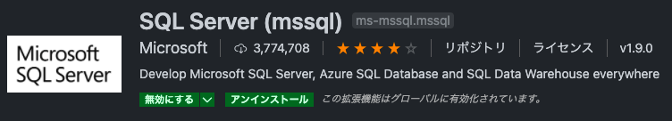
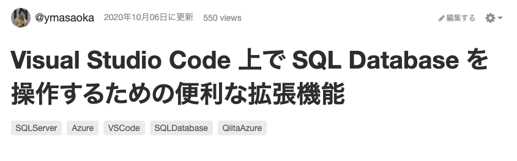
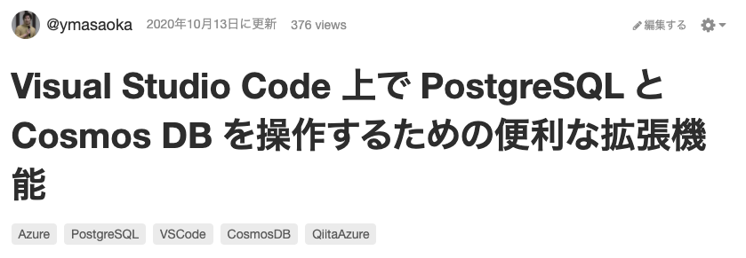

# VS Code が SQL クライアントになる  ~ DB に VS Code で接続する  

@mappie_kochi

---

# 自己紹介  

|  |  |
| :-: | :-- |
|  | **Yuji Masaoka (まっぴぃ)** Twitter: [@mappie_kochi]() GitHub: [ymasaoka]() 青い R の中の人。 Japan SQL Server User Group - Organizer Japan Azure Cosmos DB User Group - Organizer |

---

## はじめに・・・

---

# VS Code が SQL クライアントになる！？

---

## ん？そんなことできるん！？  

## **VS Code** って単なる**テキストエディタ**じゃないの！？

---

# 違うんです！！

## VS Code = テキストエディタ の考えはもう**古い**！！

---

# もはや VS Code は **DB も操作可能**なイケてるツール

と、いうわけで・・・

---

# 本日ご紹介する拡張機能は　**コチラ**　！！！

---

|&nbsp;SQL Server (mssql)

&nbsp;&nbsp;&nbsp;&nbsp;&nbsp;Azure Databases

&nbsp;&nbsp;&nbsp;&nbsp;&nbsp;PostgreSQL

&nbsp;&nbsp;&nbsp;MySQL

---

# この拡張機能、どんなメリットがあるの？

---

# VS Code が**開発のハブ**になる

VS Code と SQL クライアント \(GUI\)と、アプリケーション間で画面を移動する **無駄コストが削減**できる！

**_あら不思議、これだけであなたの生産性が●●倍に向上！！_**

---

# SQL Server (mssql)

**SQL Server**、および **Azure SQL Database** に接続する拡張機能

詳しくはブログ記事にて

- [Visual Studio Code 上で SQL Database を操作するための便利な拡張機能](https://qiita.com/ymasaoka/items/b31049b284597b91742b)

---

# Demo

---

# Azure Databases

**Azure Cosmos DB**、および **PostgreSQL / Azure Database for PostgreSQL** に接続する拡張機能

詳しくはブログ記事にて

- [Visual Studio Code 上で PostgreSQL と Cosmos DB を操作するための便利な拡張機能](https://qiita.com/ymasaoka/items/48d4a9be65856c41dafd)

---

# Demo

---

**PostgreSQL / Azure Database for PostgreSQL** に接続する拡張機能

Azure Databases でクエリ打てない問題も解決 \(2020/11/21 時点\)
詳しくは、同じブログ記事にて

- [Visual Studio Code 上で MySQL を操作するための便利な拡張機能](https://qiita.com/ymasaoka/items/aa03323bbac7e7c5f1be)

---

# Demo

---

# MySQL

**MySQL**、および **Azure SQL Database for MySQL** に接続する拡張機能

詳しくはブログ記事にて

- [Visual Studio Code 上で MySQL を操作するための便利な拡張機能](https://qiita.com/ymasaoka/items/aa03323bbac7e7c5f1be)

---

# Demo

---

# まとめ

## VS Code はもはや単なるテキストエディタじゃない！！

## プログラミングも SQL 実行も同じ VS Code で！！

## DBA も VS Code を使う時代はもうすぐそこにきている（かも？）
